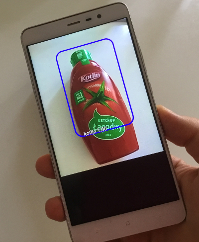

## Kotlin Detector

This is a very useful Kotlin ketchup detector.

Code is based ased on the TensorFlow Object Detection API (rewritten in Kotlin).

It uses custom retrained model (from the Coco dataset - http://cocodataset.org/#home) and TensorFlowObjectDetectionAPIModel for image recognition.
