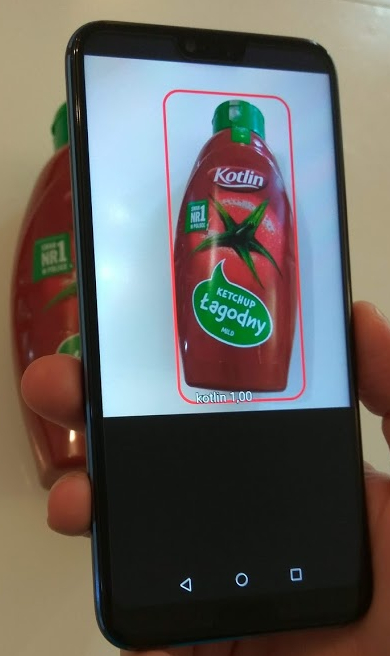

## Kotlin Detector

This is a very useful Kotlin mild ketchup detector.

Code is based ased on the TensorFlow Object Detection API (rewritten in Kotlin).

It uses custom retrained model (from the Coco dataset - http://cocodataset.org/#home) and TensorFlowObjectDetectionAPIModel for image recognition.

Here is a summary of steps needed to create your own detector: https://medium.com/@lithnere/creating-your-own-kotlin-detector-in-tensorflow-a425efcdc68b

